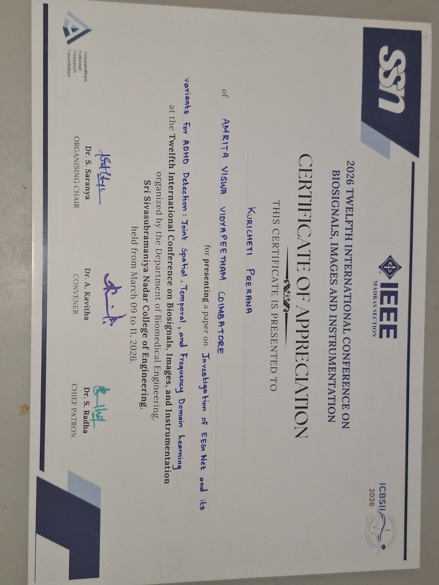

<h1 align="center">Hi 👋, I'm Kuricheti Prerana</h1>
<h3 align="center">AI/ML Engineer in the making | Building RAG systems, multimodal AI & retrieval-first products</h3>

  
  
  

---

### 🎯 About Me

- 🎓 Final-year **B.Tech in Artificial Intelligence**, Amrita Vishwa Vidyapeetham, Coimbatore — CGPA **9.06/10**
- 🔬 Deeply interested in **NLP, multilingual AI systems, and Retrieval-Augmented Generation (RAG)**
- 🛠️ I build end-to-end AI systems — from data ingestion and embeddings to production-ready retrieval pipelines
- 📄 Published & presented research on **EEG-based ADHD detection** at ICBSII 2026
- 🚀 Actively looking for **AI / ML / QA Engineering** internship and full-time opportunities
- 💬 Ask me about RAG pipelines, hybrid retrieval (BM25 + dense + reranking), or multimodal document QA

---

### 🧰 Tech Stack

**Languages**

  
  
  
  

**AI / Machine Learning**

  
  
  
  
  

**NLP / Generative AI**

  
  
  
  
  

**Computer Vision & Signal Processing**

  
  
  
  

**Databases & Tools**

  
  
  
  
  
  
  

---

### 🚀 Featured Projects

#### 🧠 [AI-Powered Startup Analyzer](#) — Multi-Agent System
A multi-agent pipeline that automates startup research and evaluation using coordinated LLM agents for information gathering, analysis, and synthesis.

#### 📚 [Orion](#) — Offline End-to-End RAG System
Fully offline retrieval-augmented generation system with document chunking, embedding generation, semantic search, and OCR support for scanned PDFs — with tuned retrieval parameters for accuracy.

#### 🌍 [NDVI Remote Sensing Analysis](#)
Vegetation health analysis pipeline using satellite imagery and NDVI indices — foundation for a peer-reviewed publication.

#### 🧬 [ADHD Detection using EEG](#) — Deep Learning
EEGNet and ShallowConvNet-based architectures jointly learning spatial, temporal, and frequency-domain EEG representations, using Butterworth filtering, FastICA artifact removal, Wilcoxon rank-sum channel selection, and subject-wise Group K-Fold validation. **Presented at ICBSII 2026.**

#### 💬 [Hinglish Sentiment Analysis](#)
Sentiment classification model tailored to code-mixed Hindi-English (Hinglish) text, addressing challenges unique to multilingual, informal text data.

---

### 📄 Research & Publications

**"Investigation of EEGNet and its variants for ADHD Detection: Joint Spatial, Temporal, and Frequency Domain Learning"**
📍 Presented at the **2026 Twelfth International Conference on Biosignals, Images, and Instrumentation (ICBSII)**, Dept. of Biomedical Engineering, SSN College of Engineering

**Authors:** Kuricheti Prerana, Niharika Sharma, Diya Dinesh, Pavani Satwika, Dr. Amrutha Veluppal

**Highlights:**
- EEG preprocessing via Butterworth band-pass filtering & FastICA artifact removal
- Feature learning with EEGNet and Modified EEGNet (ShallowConvNet)
- Wilcoxon rank-sum test for channel selection
- Subject-wise Group K-Fold validation to prevent data leakage
- Band power analysis across Delta, Theta, Alpha, Beta, and Gamma bands

📄 [View Paper](https://drive.google.com/file/d/144bgQYGNuHxCd6pGGequmV6HGM5nycrK/view?usp=sharing)

  

---

### 📊 GitHub Stats

  
  

  

---

### 📫 Let's Connect

  
  

<i>Open to AI/ML, NLP, and QA Engineering internships & full-time roles 🚀</i>

